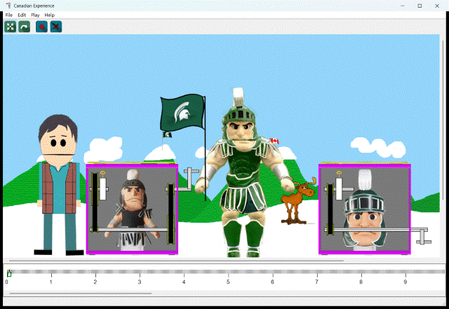
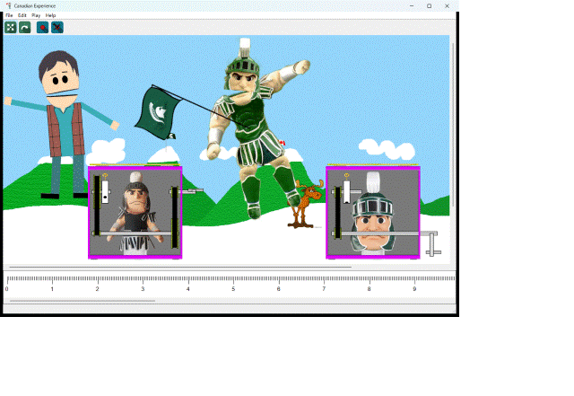
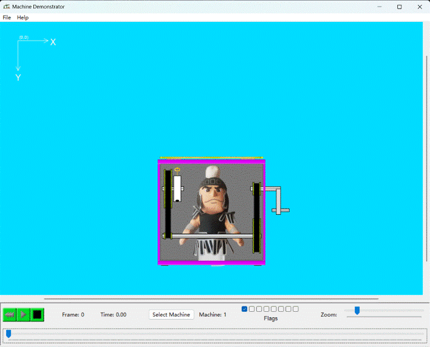

# Sparty in a Box

A C++ desktop animation application built with [wxWidgets](https://www.wxwidgets.org/).
Originally developed as part of Michigan State University's CSE 335 course on
object-oriented software design.

The program animates a 2D figure (the "Canadian Experience") alongside a fully simulated
mechanical machine — a *jack in the box*. Rotational motion originates at a hand crank
and propagates through a chain of shafts, belted pulleys, and a cam. When the cam reaches
its trigger point, the box lid springs open and a spring-loaded Sparty (the MSU mascot)
pops out, all driven by a timeline-based animation system.

## Demo



*Keyframed timeline playback: the actors animate through the scene.*

Later in the same timeline, the two embedded Sparty-in-a-box machines reach their
trigger points — the lids fly open and Sparty springs out of each box while the
actors keep moving:



The standalone Machine Demonstrator runs a single machine from start to finish. The
hand crank (right) drives a chain of shafts and belted pulleys that slowly rotate the
cam (the white cylinder, top-left). As the cam turns, its hole climbs toward the key
resting on top; the instant the hole lines up with the key, the key drops in and
releases the catch — the lid flies open and Sparty springs out of the box on an
extended coil spring:



## Features

- **Mechanical simulation** — A rotation source/sink model drives interconnected
  components (cranks, shafts, pulleys with belts, and cams) so that motion propagates
  realistically through the machine.
- **Timeline animation** — Keyframe-based timeline lets actors and machines be
  positioned and played back over time at a configurable frame rate.
- **Two prebuilt machines** — Selectable machine designs assembled from reusable
  components, plus a factory for building custom configurations.
- **Standalone demo + tests** — A separate machine demo harness and unit-test suites
  for the machine library.

## Design Patterns

The project emphasizes object-oriented design and applies several patterns:

- **Factory** — `Machine1Factory`, `Machine2Factory`, and `PictureFactory` encapsulate
  the construction of complex machine and scene objects.
- **Observer** — `PictureObserver` keeps views synchronized with the picture model;
  the rotation source/sink relationship propagates motion through components.
- **Adapter** — `MachineSystem` adapts the internal machine implementation to the fixed
  `IMachineSystem` interface used by the host application.

## Tech Stack

- **Language:** C++23
- **GUI:** wxWidgets (core, base, xrc, html, xml)
- **Build:** CMake (3.19+)
- **Docs:** Doxygen

## Building

```bash
mkdir build && cd build
cmake ..
cmake --build .
```

wxWidgets must be installed and discoverable by CMake's `find_package`.
Running the resulting executable launches the Canadian Experience application.

## Project Structure

| Directory                | Description                                              |
| ------------------------ | -------------------------------------------------------- |
| `CanadianExperienceLib/` | Animation application: actors, timeline, views, drawing  |
| `MachineLib/`            | Mechanical machine system and its components             |
| `MachineDemo/`           | Standalone machine demonstration program                 |
| `Tests/`, `MachineTests/`| Unit test suites                                         |
| `resources/`             | Images and assets used by the application                |
